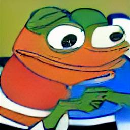

    

# Oi, my name is gamerik

### i try to make stuff

a couple examples would be:
- my [website](https://illuminaticraft.de)
- [discord bots](https://github.com/ItsGamerik/get-img) i write in rust

### you can also contact me here

---

> Alt F4 und der Tag gehört dir

— ???
